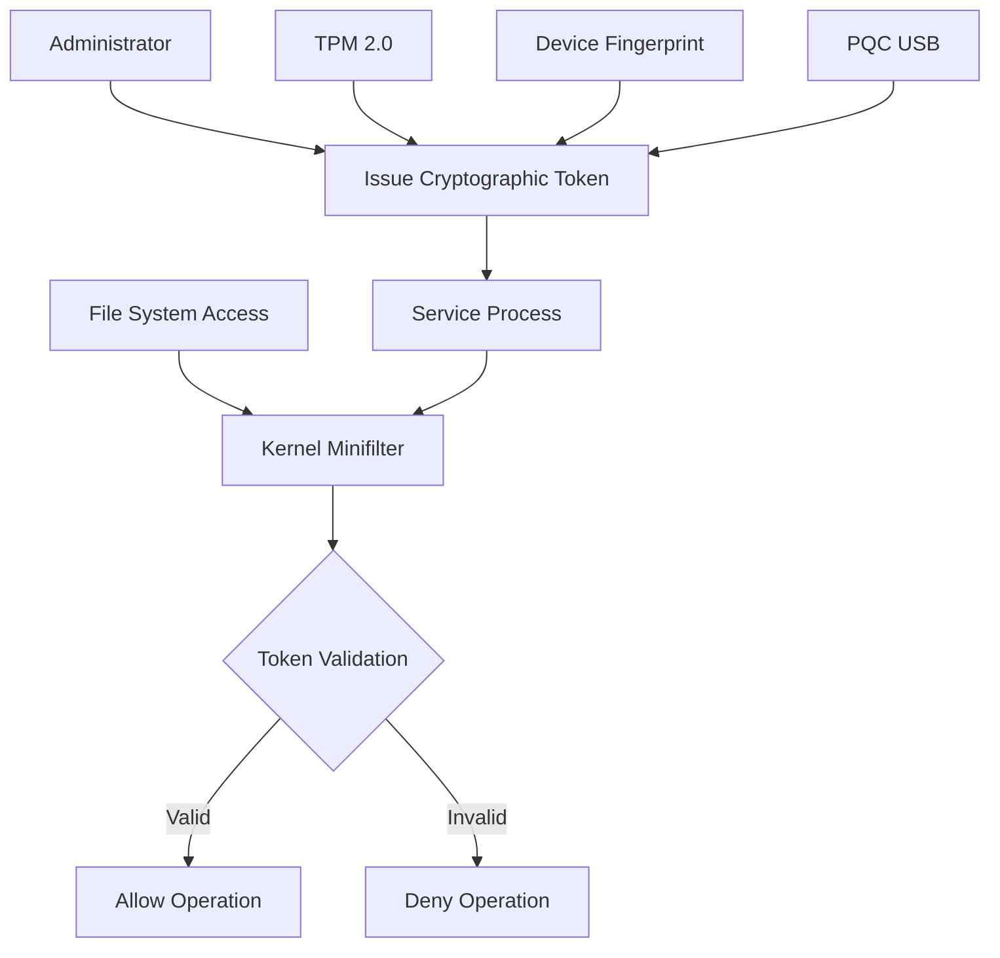
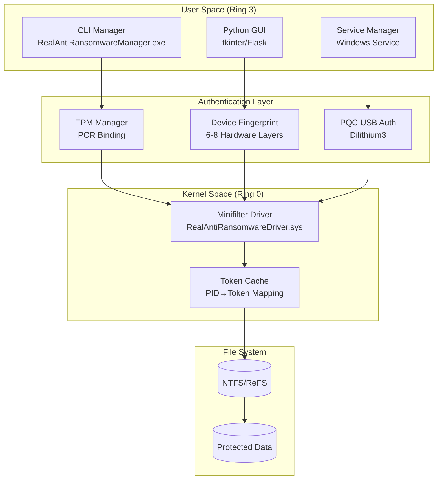
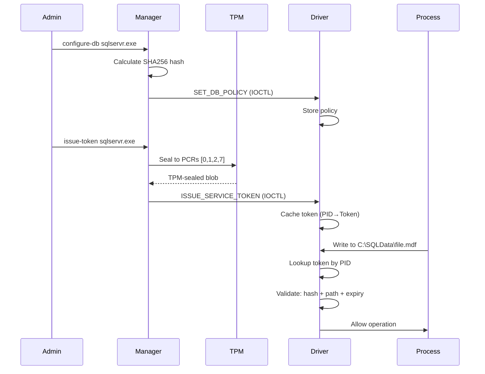
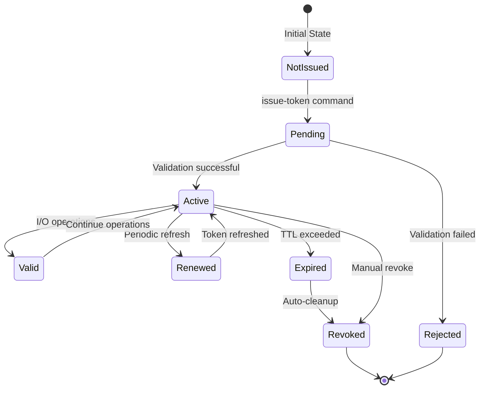
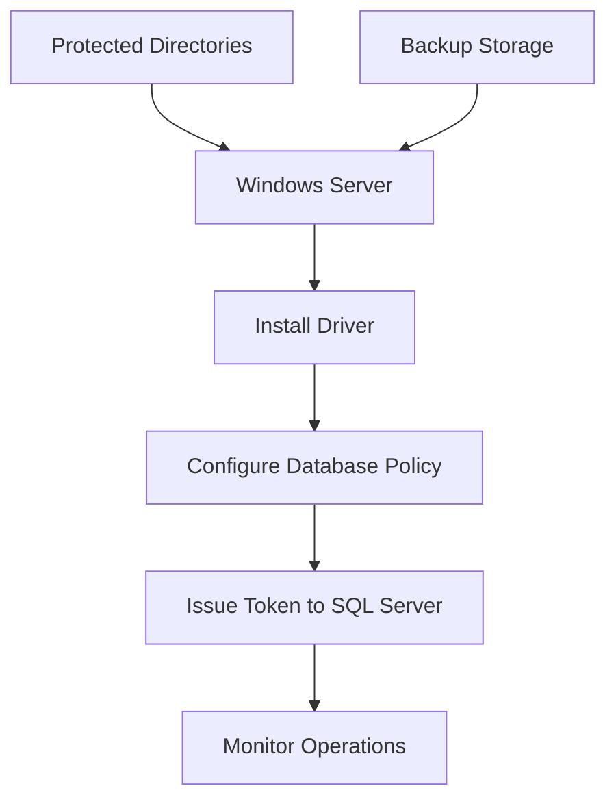
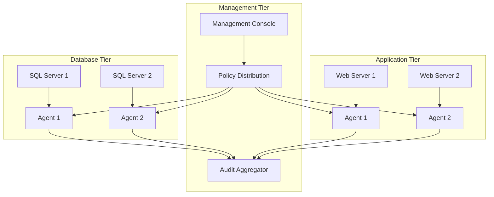

# Anti-Ransomware Protection Platform

A Windows-based ransomware defense system that implements kernel-level file system monitoring, hardware-rooted authentication, and cryptographic access tokens. The platform combines a minifilter driver, multi-factor authentication, and behavioral analysis to protect against file encryption attacks.

[](LICENSE)
[](https://www.microsoft.com/windows)
[](https://trustedcomputinggroup.org/work-groups/trusted-platform-module/)
[](https://github.com/Johnsonajibi/Ransomeware_protection)

## Contents

- [System Overview](#system-overview)
- [Architecture](#architecture)
- [Security Components](#security-components)
- [Build Instructions](#build-instructions)
- [Deployment](#deployment)
- [Configuration](#configuration)
- [Monitoring](#monitoring)
- [Troubleshooting](#troubleshooting)

## System Overview

### Design Objectives

This platform addresses specific limitations in conventional endpoint protection:

1. **Credential-based attacks**: Traditional user-mode security fails when malware obtains administrative credentials
2. **Database server protection**: Performance requirements limit file-level monitoring for database engines
3. **Service account compromise**: Legitimate system services become attack vectors after credential theft
4. **Process termination**: Malware with elevated privileges can terminate user-mode security processes

### Technical Approach



### Core Capabilities

| Component | Implementation | Function |
|-----------|---------------|----------|
| Kernel Driver | Windows minifilter (Ring 0) | IRP interception before filesystem access |
| Service Tokens | SHA256 + time-bound + path-confined | Cryptographic process authorization |
| TPM Integration | WMI + PCR measurements | Hardware-rooted platform binding |
| Device Binding | 6-8 hardware identifiers | Machine-specific token generation |
| PQC Signatures | Dilithium3 (ML-DSA-65) | Quantum-resistant authentication |
| Audit System | Process-level JSON logs | Compliance and forensic analysis |

## Architecture

### System Layers



### Authentication Flow



### Token Lifecycle



## Security Components

### TPM 2.0 Integration

Hardware-based platform attestation using Trusted Platform Module:

**Implementation:**
- Access method: WMI (`root\cimv2\Security\MicrosoftTpm`)
- PCR measurements: indices [0, 1, 2, 7]
- Seal/unseal operations for cryptographic binding
- Spec version: TPM 2.0.1.38

**Security properties:**
- Tokens sealed to specific boot state
- Platform changes invalidate sealed data
- PCR values provide cryptographic proof
- Cannot be emulated in software

**Requirements:**
- TPM 2.0 hardware module
- Administrator privileges for WMI access
- Windows 10/11 with TPM enabled in BIOS

### Device Fingerprinting

Multi-layer hardware identification for machine binding:

| Layer | Data Source | Example |
|-------|-------------|---------|
| CPU | CPUID instruction | Serial number, manufacturer |
| BIOS | WMI | UUID, firmware version |
| Network | Network adapter | MAC address (primary) |
| Storage | Disk controller | Serial number, volume GUID |
| Windows | Registry | Machine GUID, product ID |
| System | WMI | Computer name, domain |

**Hash generation:**
```
Inputs: 6-8 hardware identifiers
Algorithm: BLAKE2b(person='ar-hybrid', salt='antiransomw')
Output: 32-byte hash → 64-character hex string
```

**Properties:**
- Deterministic: consistent across reboots
- Collision-resistant: 2^256 keyspace
- Privacy-preserving: one-way hash
- Hardware-bound: changes if components replaced

### Post-Quantum Cryptography

Quantum-resistant signatures using NIST-standardized algorithms:

**Algorithm:** Dilithium3 (ML-DSA-65)
- Security level: NIST Level 3 (AES-192 equivalent)
- Standardization: FIPS 204 (Module-Lattice-Based Digital Signature Algorithm)
- Key sizes: 1952 bytes (private), 4032 bytes (public), 3309 bytes (signature)

**Implementation:**
```python
# USB drive detection
drives = UsbDriveDetector.get_removable_drives()

# Key generation (one-time)
public_key, private_key = pqcdualusb.keypair()

# Signature generation
challenge = generate_token_payload()
signature = pqcdualusb.sign(challenge, private_key)

# Verification
is_valid = pqcdualusb.verify(challenge, signature, public_key)
```

**Physical security:**
- Private key stored on removable USB drive
- Signature verification requires USB presence
- 3309-byte signatures prevent forgery
- Quantum computer resistant

### Audit Logging

Process-level security event tracking:

**Log format:** JSON Lines (.jsonl)
```json
{
  "timestamp": 1735229800.5,
  "event_type": "token_verify",
  "process_id": 2468,
  "process_name": "sqlservr.exe",
  "user": "NT SERVICE\\MSSQLSERVER",
  "tpm_used": true,
  "security_level": "MAXIMUM",
  "success": true,
  "details": {
    "factors": ["TPM", "DeviceFP", "USB"],
    "pcr_indices": [0, 1, 2, 7],
    "token_size": 3502
  }
}
```

**Capabilities:**
- Process tracking: PID, name, user account
- TPM usage verification: boolean + PCR indices
- Security level classification: MAXIMUM/HIGH/MEDIUM/LOW
- Event types: tpm_init, tpm_seal, tpm_unseal, token_issue, token_verify

**Analysis tools:**
```bash
python view_audit_logs.py summary    # Overview statistics
python view_audit_logs.py tpm        # TPM-specific events
python view_audit_logs.py recent 50  # Last N events
python view_audit_logs.py process sqlservr.exe  # By process
python view_audit_logs.py export report.txt     # Export
```

## Build Instructions

### Prerequisites

**System requirements:**
- Windows 10/11 x64
- 8GB RAM minimum
- Administrator privileges

**Development tools:**
- Visual Studio 2022 (Desktop development with C++)
- Windows Driver Kit (WDK) 10
- Python 3.10+ (3.11.9 tested)

**Verification:**
```powershell
powershell -ExecutionPolicy Bypass -File .\check.ps1
```

### Kernel Driver

```powershell
# VS Developer Command Prompt (x64), elevated
msbuild RealAntiRansomwareDriver.vcxproj /p:Configuration=Release /p:Platform=x64

# Test signing
makecert -r -pe -ss PrivateCertStore -n "CN=TestDriverCert" TestCert.cer
signtool sign /s PrivateCertStore /n "TestDriverCert" RealAntiRansomwareDriver.sys
```

**Enable test signing:**
```powershell
bcdedit /set testsigning on
shutdown /r /t 0
```

### User-Mode Manager

```powershell
cl /std:c++17 /O2 /EHsc RealAntiRansomwareManager_v2.cpp ^
   setupapi.lib newdev.lib cfgmgr32.lib crypt32.lib advapi32.lib ^
   /Fe:RealAntiRansomwareManager.exe
```

### Python Components

```powershell
python -m venv .venv
.venv\Scripts\Activate.ps1
pip install -r requirements.txt
```

**Required packages:**
- psutil: process monitoring
- wmi: TPM access
- pywin32: Windows services
- pqcdualusb: post-quantum signatures
- cryptography: encryption primitives
- flask: web dashboard

## Deployment

### Single-Host Configuration



**Installation steps:**
```powershell
# 1. Install driver
RealAntiRansomwareManager.exe install

# 2. Enable protection
RealAntiRansomwareManager.exe enable

# 3. Configure database
RealAntiRansomwareManager.exe configure-db sqlservr.exe "C:\SQLData" --hours 24

# 4. Issue token
RealAntiRansomwareManager.exe issue-token sqlservr.exe

# 5. Verify status
RealAntiRansomwareManager.exe status
```

### Multi-Tier Enterprise



**Centralized management:**
- Policy distribution via gRPC/REST
- Remote token issuance
- Aggregated audit logging
- Health monitoring and alerting

## Configuration

### Database Protection

**Policy structure:**
```cpp
struct DB_PROTECTION_POLICY {
    char ProcessName[256];          // "sqlservr.exe"
    char ProcessPath[512];          // Full path to executable
    char DataDirectory[512];        // "C:\SQLData"
    BYTE BinaryHash[32];            // SHA256 of executable
    ULONG64 TokenDurationMs;        // 86400000 (24 hours)
    BOOLEAN RequireServiceParent;   // TRUE
    BOOLEAN EnforcePathConfinement; // TRUE
};
```

**Configuration example:**
```powershell
# Calculate binary hash
$hash = RealAntiRansomwareManager.exe calc-hash "C:\Program Files\Microsoft SQL Server\MSSQL15.MSSQLSERVER\MSSQL\Binn\sqlservr.exe"

# Configure policy
RealAntiRansomwareManager.exe configure-db sqlservr.exe "C:\SQLData" --hours 24

# Issue token
RealAntiRansomwareManager.exe issue-token sqlservr.exe
```

### Security Levels

| Level | Score | Active Factors | Token Size | Use Case |
|-------|-------|----------------|------------|----------|
| MAXIMUM | 100 | TPM + DeviceFP + USB | ~3500 bytes | Production (admin install) |
| HIGH | 80 | TPM + DeviceFP | ~3400 bytes | Servers without USB |
| MEDIUM | 60 | DeviceFP + USB | ~3389 bytes | Standard workstations |
| LOW | 40 | Single factor | ~3300 bytes | Degraded mode |
| EMERGENCY | 20 | Override | ~3200 bytes | Recovery only |

**Security level selection:**
- System automatically determines available factors
- Downgrades gracefully if TPM/USB unavailable
- Admin installation enables MAXIMUM security
- Standard user installation provides MEDIUM security

## Monitoring

### Driver Statistics

```powershell
RealAntiRansomwareManager.exe status
```

**Output:**
```
Protection Level: ACTIVE
Files Monitored: 45,231
Write Operations: 3,892
Blocked Operations: 12
Encryption Attempts: 3
Service Token Validations: 1,847
Token Validation Failures: 2
Active Service Tokens: 4
```

### Audit Log Analysis

```powershell
python view_audit_logs.py summary
```

**Statistics:**
- Total events
- TPM usage percentage
- Security level distribution
- Process breakdown
- Success/failure rates
- Event type distribution

### Health Checks

```python
python health_monitor.py --check-all
```

**Checks:**
- Driver loaded and responding
- Token cache population
- Expiry status of active tokens
- Binary hash integrity
- Path confinement violations
- Suspicious pattern detection

## Troubleshooting

### Common Issues

| Problem | Cause | Solution |
|---------|-------|----------|
| Driver install fails | Missing privileges | Run as administrator |
| TPM not available | No admin rights | Use `install_with_admin.py` |
| Token validation fails | Binary updated | Recalculate hash, reissue token |
| High false positives | Overly restrictive paths | Expand allowed directories |
| Performance degradation | Monitor mode enabled | Switch to active protection |

### Diagnostic Commands

```powershell
# Check driver status
sc query AntiRansomwareFilter

# View active tokens
RealAntiRansomwareManager.exe list-tokens

# Inspect audit logs
python view_audit_logs.py recent 100

# Verify TPM status
Get-Tpm

# Check process hash
RealAntiRansomwareManager.exe calc-hash sqlservr.exe
```

### Log Locations

| Log Type | Location | Format |
|----------|----------|--------|
| Audit logs | `.audit_logs/audit_YYYYMMDD.jsonl` | JSON Lines |
| Application logs | `logs/antiransomware.log` | Plain text |
| Driver logs | Windows Event Log | Event Viewer |
| Statistics | Driver memory | IOCTL query |

## Security Considerations

### Operational Security

1. **Least privilege**: Run management tools as administrator only when necessary
2. **Token rotation**: Schedule periodic token renewal (24-hour default)
3. **Path confinement**: Restrict database writes to dedicated volumes
4. **Audit review**: Monitor logs for anomalies and unauthorized access
5. **Test signing**: Disable in production, use EV certificate

### Threat Model

**Protected against:**
- Credential theft attacks
- Process injection
- Service account compromise
- Rapid file encryption
- Shadow copy deletion
- Credential dumping

**Not protected against:**
- Kernel-mode malware (same privilege level)
- Boot sector infections
- Physical access attacks
- Social engineering
- Zero-day kernel exploits

### Compliance

**Audit capabilities:**
- Process-level attribution
- Cryptographic proof of TPM usage
- Complete access history
- Tamper-evident logging
- SIEM integration ready

**Standards alignment:**
- TPM 2.0 specification
- NIST post-quantum cryptography
- Windows driver signing requirements
- Secure boot compatibility

## Contributing

Development guidelines:

1. Follow Windows driver development best practices
2. Test all changes with kernel debugger
3. Run security validation: `python final_security_check.py`
4. Update audit log schema if modifying events
5. Document IOCTL interface changes

## License

MIT License - see LICENSE file for details

## References

- [TPM 2.0 Specification](https://trustedcomputinggroup.org/resource/tpm-library-specification/)
- [Windows Driver Development](https://docs.microsoft.com/en-us/windows-hardware/drivers/)
- [NIST Post-Quantum Cryptography](https://csrc.nist.gov/projects/post-quantum-cryptography)
- [Minifilter Driver Programming](https://docs.microsoft.com/en-us/windows-hardware/drivers/ifs/filter-manager-concepts)

## Contact

For security issues, create a private security advisory on GitHub.
