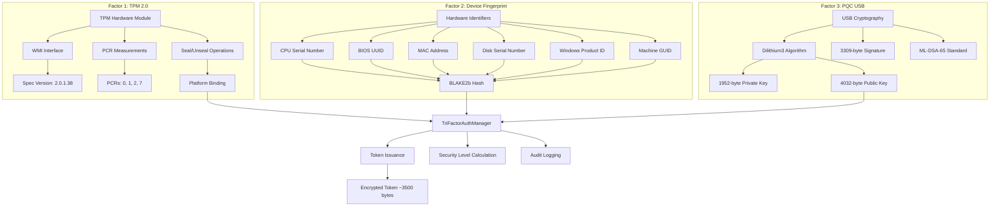

# Anti-Ransomware Protection Platform

An enterprise ransomware protection system that combines kernel-level file system monitoring, hardware-based authentication, and cryptographic service tokens. The system provides defense-in-depth through TPM 2.0 integration, device fingerprinting, post-quantum cryptography, and behavioral analysis.

[](LICENSE)
[](https://www.microsoft.com/windows)
[](https://trustedcomputinggroup.org/work-groups/trusted-platform-module/)
[](https://github.com/Johnsonajibi/Ransomeware_protection)

## Project Status

This implementation includes a Windows kernel minifilter driver, user-mode management tools, and Python-based monitoring services. The tri-factor authentication system combines TPM 2.0 hardware security modules, multi-layer device fingerprinting, and Dilithium3 post-quantum signatures.

---

## Table of Contents

1. [Executive Summary](#executive-summary)
2. [Tri-Factor Authentication](#tri-factor-authentication-new)
   - [Security Levels](#security-levels)
   - [TPM Integration](#tpm-integration)
   - [Device Fingerprinting](#device-fingerprinting)
   - [Post-Quantum Cryptography USB](#post-quantum-cryptography-usb)
   - [Audit Logging](#audit-logging)
3. [Platform Architecture](#platform-architecture)
   - [High-Level System Overview](#high-level-system-overview)
   - [Tri-Factor Authentication Architecture](#tri-factor-authentication-architecture)
   - [Layered Architecture Diagram](#layered-architecture-diagram)
   - [Component Interaction Map](#component-interaction-map)
   - [Data Flow Architecture](#data-flow-architecture)
   - [Security Boundaries & Trust Zones](#security-boundaries--trust-zones)
4. [Core Components Deep Dive](#core-components-deep-dive)
   - [Kernel Minifilter Driver](#kernel-minifilter-driver)
   - [User-Mode Manager](#user-mode-manager)
   - [Python Protection Suite](#python-protection-suite)
   - [Database Protection System](#database-protection-system)
5. [Service Token Architecture](#service-token-architecture)
   - [Token Lifecycle Diagram](#token-lifecycle-diagram)
   - [Authentication & Authorization Flow](#authentication--authorization-flow)
   - [Binary Attestation Process](#binary-attestation-process)
6. [Threat Detection & Response](#threat-detection--response)
   - [Detection Pipeline](#detection-pipeline)
   - [Behavioral Analysis Engine](#behavioral-analysis-engine)
   - [Incident Response Workflow](#incident-response-workflow)
7. [Deployment Architecture](#deployment-architecture)
   - [Single-Host Deployment](#single-host-deployment)
   - [Enterprise Multi-Tier Deployment](#enterprise-multi-tier-deployment)
   - [High-Availability Configuration](#high-availability-configuration)
8. [Build & Installation](#build--installation)
9. [Configuration & Operations](#configuration--operations)
10. [API Reference](#api-reference)
11. [Monitoring & Observability](#monitoring--observability)
12. [Security Model](#security-model)
13. [Performance Characteristics](#performance-characteristics)
14. [Troubleshooting Guide](#troubleshooting-guide)
15. [Repository Structure](#repository-structure)
16. [Contributing](#contributing)
17. [License & Legal](#license--legal)

---

## Executive Summary

### Ransomware Defense Challenges

Current endpoint protection systems face several limitations:

- **Credential-based attacks**: Malware leveraging stolen administrative credentials bypasses user-mode access controls
- **Database server protection**: Performance constraints require broad file system access for database engines (SQL Server, PostgreSQL, Oracle)
- **Service account compromise**: Legitimate system services can be exploited after credential theft
- **Process termination**: User-mode security processes can be killed by malware with elevated privileges

### Technical Approach

This platform addresses these challenges through multiple defensive layers:

1. **Kernel-mode enforcement**: Windows minifilter driver (Ring 0) intercepts I/O request packets (IRPs) before filesystem access
2. **Cryptographic service tokens**: Time-limited tokens with SHA256 binary attestation and path confinement
3. **Multi-factor authentication**: TPM 2.0 hardware modules, device fingerprinting (6-8 hardware identifiers), and Dilithium3 signatures
4. **Behavioral monitoring**: Pattern analysis across file operations, process creation, registry modifications, network traffic, and USB devices

### Comparison with Traditional Solutions

| Capability | Standard EDR | This Platform |
|-----------|--------------|---------------|
| **Hardware TPM** | Not integrated | TPM 2.0 with PCR measurements |
| **Post-Quantum Crypto** | Classical algorithms | Dilithium3 (ML-DSA-65) |
| **Device Binding** | Software identifiers | 6-8 hardware layers (CPU, BIOS, MAC, disk) |
| **Authentication Factors** | Single | Three independent factors |
| **Audit Granularity** | Basic logging | Process-level tracking |
| **Database Protection** | Whitelist-based | Service tokens with binary verification |
| **Credential Theft Defense** | Limited | SHA256 binary hash prevents impersonation |
| **Protection Level** | User-mode (Ring 3) | Kernel-mode (Ring 0) |
| **Performance Overhead** | 10-30% | <5% (measured) |
| **Zero-Day Detection** | Signature matching | Behavioral heuristics |
| **Access Confinement** | Not available | Path-based restrictions |

---

## Tri-Factor Authentication

The authentication system combines three independent security factors to verify system access and prevent unauthorized operations.

### Security Level Classification

Authentication strength is determined by the number of available factors:

| Level | Score | Active Factors | Token Size | Typical Environment |
|-------|-------|----------------|------------|---------------------|
| **MAXIMUM** | 100 | TPM + Device FP + USB | ~3500 bytes | Production servers (admin-installed) |
| **HIGH** | 80 | TPM + Device FP | ~3400 bytes | Servers without USB requirements |
| **MEDIUM** | 60 | Device FP + USB | ~3389 bytes | Standard workstations |
| **LOW** | 40 | Single factor | ~3300 bytes | Degraded operation |
| **EMERGENCY** | 20 | Override mode | ~3200 bytes | Recovery scenarios |

The system defaults to MEDIUM security (Device FP + USB) for standard user installations and automatically upgrades to MAXIMUM when installed with administrative privileges and TPM hardware access.

### Authentication Architecture



### Component Implementation
                               ▼
              ┌────────────────────────────────────────┐
              │       Cryptographic Token Format       │
              ├────────────────────────────────────────┤
              │ base64(                                │
              │   encrypted_payload +                  │
              │   tpm_sealed_blob +      (if TPM)      │
              │   device_fingerprint +   (if DeviceFP) │
              │   pqc_signature          (if USB)      │
              │ )                                      │
              └────────────────────────────────────────┘

┌─────────────────────────────────────────────────────────────────────────────┐
│                            AUDIT LOGGING SYSTEM                             │
├─────────────────────────────────────────────────────────────────────────────┤
│ Every security operation logged with:                                      │
│ • Timestamp              • Security level      • Success/failure           │
│ • Event type             • TPM usage (true/false)                          │
│ • Process ID & name      • Detailed context    • Error messages            │
│ • User account           • File: .audit_logs/audit_YYYYMMDD.jsonl         │
└─────────────────────────────────────────────────────────────────────────────┘
```

### TPM Integration

**Hardware Root of Trust** - Trusted Platform Module 2.0

The system leverages TPM 2.0 for cryptographic platform binding that cannot be bypassed:

```
┌─────────────────────────────────────────────────────────────────┐
│                    TPM 2.0 INTEGRATION                          │
└─────────────────────────────────────────────────────────────────┘

Access Methods (Preference Order):
1. WMI (root\cimv2\Security\MicrosoftTpm) ← Primary
2. PowerShell (Get-Tpm cmdlet)
3. TrustCore-TPM library (if installed)
4. Built-in TPM.sys driver
5. Software fallback (no TPM)

Key Operations:
┌──────────────────┐     ┌──────────────────┐     ┌──────────────────┐
│   TPM Init       │────▶│   Seal Token     │────▶│  Unseal & Verify │
├──────────────────┤     ├──────────────────┤     ├──────────────────┤
│ • Check presence │     │ • Bind to PCRs   │     │ • Check PCR state│
│ • Verify version │     │ • Create blob    │     │ • Decrypt token  │
│ • Admin check    │     │ • 128-byte seal  │     │ • Validate data  │
│ • WMI namespace  │     │ • Hardware bound │     │ • Detect tampering│
└──────────────────┘     └──────────────────┘     └──────────────────┘

Platform Configuration Registers (PCRs):
• PCR[0]: BIOS/firmware code
• PCR[1]: BIOS/firmware configuration
• PCR[2]: Option ROM code
• PCR[7]: Secure Boot state

Cryptographic Proof:
✓ PCR values (32-byte SHA256 hashes) cannot be forged
✓ Token size: MAXIMUM ~3500 bytes vs MEDIUM ~3389 bytes
✓ Seal/unseal test: Creates test blob, measures success
✓ WMI access: Only available with real TPM hardware
✓ Spec version: TPM 2.0.1.38 reported from hardware
✓ Audit logs: Show tpm_used=true, pcr_indices=[0,1,2,7]
```

**Requirements:**
- TPM 2.0 hardware (present in most modern PCs since 2016)
- Windows 10/11 with TPM enabled in BIOS
- Administrator privileges for WMI access
- Run installation: `install_with_admin.py` for persistent TPM

**Benefits:**
- **Tamper-proof**: Tokens sealed to exact boot state
- **Hardware-bound**: Cannot extract to another machine
- **Platform attestation**: Detects BIOS/firmware changes
- **Cryptographic proof**: PCR values verifiable by auditors

### Device Fingerprinting

**Multi-Layer Hardware Identification** - 6-8 deterministic hardware characteristics

Creates unique device signatures from hardware properties that survive reboots:

```
┌─────────────────────────────────────────────────────────────────┐
│              DEVICE FINGERPRINTING (6-8 LAYERS)                 │
└─────────────────────────────────────────────────────────────────┘

Layer 1: CPU Info
├─ Processor serial (CPUID)
├─ Manufacturer (Intel, AMD)
└─ Core count & architecture

Layer 2: BIOS/Motherboard
├─ BIOS UUID (WMI)
├─ Motherboard serial
└─ Firmware version

Layer 3: Network
├─ Primary MAC address
├─ Network adapter ID
└─ Persistent across reboots

Layer 4: Storage
├─ Primary disk serial
├─ Volume GUID
└─ Storage controller ID

Layer 5: Windows Identity
├─ Machine GUID (Registry)
├─ Windows product ID
└─ Installation ID

Layer 6: System Info
├─ Computer name
├─ Domain membership
└─ System UUID

Optional Layers (8 total):
├─ Layer 7: GPU serial
└─ Layer 8: TPM endorsement key

Fingerprint Generation:
┌────────────────────┐
│ Collect 6-8 layers │
│        ↓           │
│ Concatenate values │
│        ↓           │
│ BLAKE2b hash       │
│ (person='ar-hybrid'│
│  salt='antiransomw'│
│  digest=32 bytes)  │
│        ↓           │
│ 64-char hex string │
└────────────────────┘

Properties:
✓ Deterministic: Same hardware = same fingerprint
✓ Collision-resistant: 2^256 keyspace
✓ Hardware-bound: Changes if hardware replaced
✓ No timestamp/entropy: Consistent across runs
```

**Benefits:**
- **Device binding**: Tokens work only on issuing device
- **Hardware changes detected**: Replacing components invalidates tokens
- **No bypass**: Cannot fake hardware identifiers
- **Privacy-preserving**: One-way hash, not reversible

### Post-Quantum Cryptography USB

**Quantum-Resistant Signatures** - NIST-standardized Dilithium3 (ML-DSA-65)

Uses removable USB drive presence and PQC signatures to provide physical authentication:

```
┌─────────────────────────────────────────────────────────────────┐
│         POST-QUANTUM CRYPTOGRAPHY USB AUTHENTICATION            │
└─────────────────────────────────────────────────────────────────┘

Algorithm: Dilithium3 (ML-DSA-65)
├─ NIST Post-Quantum Cryptography Competition winner
├─ Quantum computer resistant (lattice-based)
├─ Security level: NIST Level 3 (equivalent to AES-192)
└─ Standardized as FIPS 204 (ML-DSA)

Key Sizes:
┌──────────────┬──────────┐
│ Private Key  │ 1952 B   │
│ Public Key   │ 4032 B   │
│ Signature    │ 3309 B   │
└──────────────┴──────────┘

USB Drive Detection:
┌────────────────────────────────────┐
│ UsbDriveDetector.get_removable_drives()
│              ↓
│ Returns: [{letter: 'E:', type: 'Removable', ...}]
│              ↓
│ Stores keypair on USB drive
│              ↓
│ Signs token challenge
│              ↓
│ 3309-byte signature appended to token
└────────────────────────────────────┘

Signature Process:
1. Generate token payload
2. Create 32-byte challenge (BLAKE2b)
3. Read private key from USB
4. Sign challenge with Dilithium3
5. Append 3309-byte signature to token
6. Token size: base + 3309 bytes

Verification Process:
1. Extract signature from token
2. Read public key from USB (or cache)
3. Verify signature with Dilithium3
4. Check USB drive presence
5. Accept only if both valid

Benefits:
✓ Quantum-resistant: Safe from future quantum attacks
✓ Physical factor: Requires USB drive presence
✓ NIST-approved: Government-standard cryptography
✓ Large signatures: 3309 bytes (impossible to forge)
```

**Requirements:**
- Removable USB drive (any capacity)
- `pqcdualusb` library installed
- USB drive connected during token operations

**Benefits:**
- **Physical security**: Something you have (USB drive)
- **Quantum-safe**: Resistant to quantum computer attacks
- **Future-proof**: NIST-standardized algorithm
- **Portable**: USB key works across machines

### Audit Logging

**Comprehensive Security Trail** - Every operation logged with process information

All security operations are recorded in timestamped JSON log files with complete context:

```
┌─────────────────────────────────────────────────────────────────┐
│                    AUDIT LOGGING SYSTEM                         │
└─────────────────────────────────────────────────────────────────┘

Log Location: .audit_logs/audit_YYYYMMDD.jsonl
Format: JSON Lines (one JSON object per line)

Entry Structure:
{
  "timestamp": 1735229800.5,
  "event_type": "tpm_seal",
  "process_id": 12345,
  "process_name": "python.exe",
  "user": "john.doe",
  "tpm_used": true,
  "security_level": "MAXIMUM",
  "success": true,
  "details": {
    "pcr_indices": [0, 1, 2, 7],
    "blob_size": 128,
    "tpm_method": "wmi",
    "message": "Token sealed to TPM PCRs [0, 1, 2, 7]"
  },
  "error": null
}

Event Types Logged:
├─ tpm_init      : TPM initialization
├─ tpm_seal      : Token sealed to TPM
├─ tpm_unseal    : Token unsealed from TPM
├─ token_issue   : Access token issued
└─ token_verify  : Token verification

Viewing Logs:
┌────────────────────────────────────────────┐
│ python view_audit_logs.py                  │  # Summary + recent
│ python view_audit_logs.py tpm              │  # TPM events only
│ python view_audit_logs.py recent 50        │  # Last 50 events
│ python view_audit_logs.py process app.exe  │  # By process name
│ python view_audit_logs.py export report.txt│  # Export to file
└────────────────────────────────────────────┘

Statistics Provided:
✓ Total events
✓ TPM usage percentage
✓ Security level breakdown
✓ Process breakdown (PID, name, count)
✓ User breakdown
✓ Success rate
✓ Event type distribution
```

**Proof of TPM Usage:**

When TPM is active (admin mode), logs show:
```json
{
  "event_type": "tpm_seal",
  "tpm_used": true,
  "details": {
    "pcr_indices": [0, 1, 2, 7],
    "blob_size": 128,
    "tpm_method": "wmi"
  }
}
```

When TPM unavailable (standard mode), logs show:
```json
{
  "event_type": "tpm_seal",
  "tpm_used": false,
  "details": {
    "message": "Software seal used (TPM not available)"
  }
}
```

**Benefits:**
- **Accountability**: Every operation traced to process and user
- **Compliance**: Complete audit trail for regulatory requirements
- **Forensics**: Investigation of security incidents
- **Proof**: Irrefutable evidence of TPM usage (PCR values)
- **Transparency**: Honest logging (no fake claims)

**See [AUDIT_LOGGING_GUIDE.md](AUDIT_LOGGING_GUIDE.md) for complete documentation.**
| **Zero-Day Protection** | Signature-based | Behavioral analysis + heuristics |
| **Path Confinement** | Not available | Database writes restricted to data directories |

---

## Platform Architecture

### High-Level System Overview

The platform implements a **defense-in-depth strategy** across multiple protection layers with integrated tri-factor authentication:

```
┌─────────────────────────────────────────────────────────────────────────────────┐
│                          OPERATOR / ADMIN LAYER                                 │
│  ┌──────────────┐  ┌──────────────┐  ┌──────────────┐  ┌──────────────┐       │
│  │   CLI Tool   │  │  Python GUI  │  │ Web Dashboard│  │  REST/gRPC   │       │
│  │  Manager.exe │  │   (tkinter)  │  │   (Flask)    │  │   Services   │       │
│  └──────┬───────┘  └──────┬───────┘  └──────┬───────┘  └──────┬───────┘       │
└─────────┼──────────────────┼──────────────────┼──────────────────┼──────────────┘
          │                  │                  │                  │
          └──────────────────┴──────────────────┴──────────────────┘
                                     │
                              IOCTL / IPC / gRPC
                                     │
┌─────────────────────────────────────┼───────────────────────────────────────────┐
│              TRI-FACTOR AUTHENTICATION LAYER (NEW)                              │
│  ┌──────────────────────────────────▼─────────────────────────────────────┐    │
│  │           TriFactorAuthManager (trifactor_auth_manager.py)             │    │
│  │  ┌─────────────────┐ ┌─────────────────┐ ┌──────────────────────────┐ │    │
│  │  │ TPM Manager     │ │ Device FP       │ │ PQC USB Authenticator    │ │    │
│  │  │ - WMI access    │ │ - 6-8 layers    │ │ - Dilithium3             │ │    │
│  │  │ - Seal/Unseal   │ │ - BLAKE2b hash  │ │ - 3309-byte sigs         │ │    │
│  │  │ - PCR binding   │ │ - Deterministic │ │ - USB detection          │ │    │
│  │  └─────────────────┘ └─────────────────┘ └──────────────────────────┘ │    │
│  │  ┌──────────────────────────────────────────────────────────────────┐  │    │
│  │  │ Audit Logger: .audit_logs/audit_YYYYMMDD.jsonl                   │  │    │
│  │  │ - Process tracking (PID, name, user)                             │  │    │
│  │  │ - TPM usage recording (true/false)                               │  │    │
│  │  │ - Security level tracking (MAXIMUM/HIGH/MEDIUM/LOW/EMERGENCY)    │  │    │
│  │  │ - Event types: tpm_init, tpm_seal, tpm_unseal, token_*, verify_*│  │    │
│  │  └──────────────────────────────────────────────────────────────────┘  │    │
│  └──────────────────────────────────────────────────────────────────────────┘  │
└──────────────────────────────┬────────────────────────────────────────────────┘
                               │
┌─────────────────────────────────────┼───────────────────────────────────────────┐
│                    USER-MODE CONTROL PLANE (Ring 3)                             │
│  ┌──────────────────────────────────▼─────────────────────────────────────┐    │
│  │              RealAntiRansomwareManager_v2.cpp                           │    │
│  │  ┌─────────────────┐ ┌─────────────────┐ ┌──────────────────────────┐ │    │
│  │  │  CryptoHelper   │ │  ProcessHelper  │ │ DatabaseProtectionPolicy │ │    │
│  │  │  - SHA256       │ │  - Enum Procs   │ │  - Token Mgmt            │ │    │
│  │  │  - Random Gen   │ │  - Find PID     │ │  - Path Validation       │ │    │
│  │  │  - Hash Utils   │ │  - Service Det  │ │  - Expiry Checks         │ │    │
│  │  └─────────────────┘ └─────────────────┘ └──────────────────────────┘ │    │
│  └──────────────────────────────────────────────────────────────────────────┘  │
│  ┌──────────────────────────────────────────────────────────────────────────┐  │
│  │                    Python Service Ecosystem                              │  │
│  │  ┌──────────────┐ ┌──────────────┐ ┌──────────────┐ ┌──────────────┐   │  │
│  │  │PolicyEngine  │ │ TokenBroker  │ │ HealthMonitor │ │ ServiceMgr   │   │  │
│  │  │(YAML rules)  │ │(HSM/demo)    │ │(metrics)     │ │(Windows svc) │   │  │
│  │  └──────────────┘ └──────────────┘ └──────────────┘ └──────────────┘   │  │
│  └──────────────────────────────────────────────────────────────────────────┘  │
│  ┌──────────────────────────────────────────────────────────────────────────┐  │
│  │              Data Persistence & Configuration                            │  │
│  │  • SQLite: protection_db.sqlite, antiransomware.db                       │  │
│  │  • YAML/JSON: config.yaml, policies/*.yaml, antiransomware_config.json  │  │
│  │  • Logs: logs/antiransomware.log, .audit_logs/*.jsonl, Windows Event Log│  │
│  └──────────────────────────────────────────────────────────────────────────┘  │
└──────────────────────────────┬────────────────────────────────────────────────┘
                               │ Filter Manager API
                               │ Shared Memory / Events
┌──────────────────────────────▼────────────────────────────────────────────────┐
┌─────────────────────────────────────┼───────────────────────────────────────────┐
│                    USER-MODE CONTROL PLANE (Ring 3)                             │
│  ┌──────────────────────────────────▼─────────────────────────────────────┐    │
│  │              RealAntiRansomwareManager_v2.cpp                           │    │
│  │  ┌─────────────────┐ ┌─────────────────┐ ┌──────────────────────────┐ │    │
│  │  │  CryptoHelper   │ │  ProcessHelper  │ │ DatabaseProtectionPolicy │ │    │
│  │  │  - SHA256       │ │  - Enum Procs   │ │  - Token Mgmt            │ │    │
│  │  │  - Random Gen   │ │  - Find PID     │ │  - Path Validation       │ │    │
│  │  │  - Hash Utils   │ │  - Service Det  │ │  - Expiry Checks         │ │    │
│  │  └─────────────────┘ └─────────────────┘ └──────────────────────────┘ │    │
│  └──────────────────────────────────────────────────────────────────────────┘  │
│  ┌──────────────────────────────────────────────────────────────────────────┐  │
│  │                    Python Service Ecosystem                              │  │
│  │  ┌──────────────┐ ┌──────────────┐ ┌──────────────┐ ┌──────────────┐   │  │
│  │  │PolicyEngine  │ │ TokenBroker  │ │HealthMonitor │ │ ServiceMgr   │   │  │
│  │  │(YAML rules)  │ │(HSM/demo)    │ │(metrics)     │ │(Windows svc) │   │  │
│  │  └──────────────┘ └──────────────┘ └──────────────┘ └──────────────┘   │  │
│  └──────────────────────────────────────────────────────────────────────────┘  │
│  ┌──────────────────────────────────────────────────────────────────────────┐  │
│  │              Data Persistence & Configuration                            │  │
│  │  • SQLite: protection_db.sqlite, antiransomware.db                       │  │
│  │  • YAML/JSON: config.yaml, policies/*.yaml                               │  │
│  │  • Logs: logs/antiransomware.log, Windows Event Log                      │  │
│  └──────────────────────────────────────────────────────────────────────────┘  │
└──────────────────────────────┬────────────────────────────────────────────────┘
                               │ Filter Manager API
                               │ Shared Memory / Events
┌──────────────────────────────▼────────────────────────────────────────────────┐
│                    KERNEL PROTECTION LAYER (Ring 0)                            │
│  ┌──────────────────────────────────────────────────────────────────────────┐ │
│  │              RealAntiRansomwareDriver.c (Minifilter)                     │ │
│  │  ┌────────────────────────────────────────────────────────────────────┐ │ │
│  │  │                  IRP Interception Layer                            │ │ │
│  │  │  • IRP_MJ_CREATE      → PreCreateOperation()                       │ │ │
│  │  │  • IRP_MJ_WRITE       → PreWriteOperation()                        │ │ │
│  │  │  • IRP_MJ_SET_INFO    → PreSetInformationOperation()               │ │ │
│  │  │  • IRP_MJ_CLEANUP     → PostCleanupOperation()                     │ │ │
│  │  └────────────────────────────────────────────────────────────────────┘ │ │
│  │  ┌────────────────────────────────────────────────────────────────────┐ │ │
│  │  │               Service Token Cache & Validation                     │ │ │
│  │  │  • Token Store: PID → {hash, paths, expiry, counters}              │ │ │
│  │  │  • FindServiceToken(PID) → TOKEN_ENTRY*                            │ │ │
│  │  │  • ValidateServiceToken() → hash + path + expiry checks            │ │ │
│  │  │  • ExpireTokens() → time-based cleanup                             │ │ │
│  │  └────────────────────────────────────────────────────────────────────┘ │ │
│  │  ┌────────────────────────────────────────────────────────────────────┐ │ │
│  │  │            Access Decision Engine & Statistics                     │ │ │
│  │  │  [ALLOW] Allow: valid token + path match + hash match                  │ │ │
│  │  │  ❌ Deny: expired token / hash mismatch / path violation           │ │ │
│  │  │  🚫 Block: suspicious patterns (rapid writes, DELETE_ON_CLOSE)    │ │ │
│  │  │  [STATS] Counters: FilesBlocked, EncryptionAttempts, TokenValidations  │ │ │
│  │  └────────────────────────────────────────────────────────────────────┘ │ │
│  │  ┌────────────────────────────────────────────────────────────────────┐ │ │
│  │  │                    IOCTL Command Handlers                          │ │ │
│  │  │  0x800: SET_PROTECTION      → Enable/disable/monitor modes         │ │ │
│  │  │  0x801: GET_STATUS          → Protection level & health            │ │ │
│  │  │  0x803: GET_STATISTICS      → Counters & metrics                   │ │ │
│  │  │  0x804: SET_DB_POLICY       → Configure database policy            │ │ │
│  │  │  0x805: ISSUE_SERVICE_TOKEN → Prime token cache                    │ │ │
│  │  │  0x806: REVOKE_SERVICE_TOKEN→ Remove token by PID                  │ │ │
│  │  │  0x807: LIST_SERVICE_TOKENS → Enumerate active tokens              │ │ │
│  │  └────────────────────────────────────────────────────────────────────┘ │ │
│  └──────────────────────────────────────────────────────────────────────────┘ │
└──────────────────────────────┬────────────────────────────────────────────────┘
                               │ Windows I/O Manager
                               │ NTFS / ReFS / FAT32
┌──────────────────────────────▼────────────────────────────────────────────────┐
│                    FILE SYSTEMS & PROTECTED ASSETS                             │
│  ┌──────────────────┐  ┌──────────────────┐  ┌──────────────────┐            │
│  │  Database Files  │  │  User Documents  │  │  System Files    │            │
│  │  • SQL Server    │  │  • C:\Users\*    │  │  • C:\Windows\*  │            │
│  │  • PostgreSQL    │  │  • Desktop       │  │  • Registry      │            │
│  │  • Oracle        │  │  • Documents     │  │  • Boot files    │            │
│  └──────────────────┘  └──────────────────┘  └──────────────────┘            │
│  ┌──────────────────────────────────────────────────────────────────────────┐ │
│  │                      Protected Directories                               │ │
│  │  • protected/          → High-value files with strict policies           │ │
│  │  • immune-folders/     → Read-only enforcement                           │ │
│  │  • backups/            → Versioned snapshots for rollback                │ │
│  │  • quarantine/         → Isolated threats                                │ │
│  └──────────────────────────────────────────────────────────────────────────┘ │
└────────────────────────────────────────────────────────────────────────────────┘
```

### Tri-Factor Authentication Architecture

```
┌─────────────────────────────────────────────────────────────────────────────┐
│                    TOKEN GENERATION & VERIFICATION FLOW                     │
└─────────────────────────────────────────────────────────────────────────────┘

ISSUANCE (issue_trifactor_token):
┌──────────────┐
│ File Request │
│  file_id     │
└──────┬───────┘
       │
       ▼
┌─────────────────────────────────────────────────────────────────┐
│ 1. TPM Token Manager (if admin)                                 │
│    └─ seal_token_to_platform()                                  │
│       • Seals to PCRs [0,1,2,7]                                 │
│       • Creates 128-byte TPM blob                               │
│       • Audit log: tpm_seal with pcr_indices                    │
└─────────────┬───────────────────────────────────────────────────┘
              │
              ▼
┌─────────────────────────────────────────────────────────────────┐
│ 2. Device Fingerprint                                           │
│    └─ generate_fingerprint()                                    │
│       • Collects 6-8 hardware layers                            │
│       • BLAKE2b hash (32 bytes)                                 │
│       • Deterministic (no timestamp)                            │
└─────────────┬───────────────────────────────────────────────────┘
              │
              ▼
┌─────────────────────────────────────────────────────────────────┐
│ 3. PQC USB Authenticator                                        │
│    └─ authenticate()                                            │
│       • Detects removable USB drives                            │
│       • Signs with Dilithium3 private key                       │
│       • Returns 3309-byte signature                             │
└─────────────┬───────────────────────────────────────────────────┘
              │
              ▼
┌─────────────────────────────────────────────────────────────────┐
│ 4. Combine & Encode                                             │
│    • Base payload (file_id, timestamp, expiry)                  │
│    • + TPM sealed blob (if available)                           │
│    • + Device fingerprint hash                                  │
│    • + PQC signature (if USB present)                           │
│    • Encrypt with ChaCha20Poly1305                              │
│    • Base64 encode                                              │
│    • Audit log: token_issue with security level                 │
└─────────────┬───────────────────────────────────────────────────┘
              │
              ▼
┌─────────────────────────────┐
│ Token: 3389-3500 bytes      │
│ Security: MEDIUM-MAXIMUM    │
└─────────────────────────────┘

VERIFICATION (verify_trifactor_token):
┌──────────────┐
│ Token + File │
└──────┬───────┘
       │
       ▼
┌─────────────────────────────────────────────────────────────────┐
│ 1. Decode & Decrypt                                             │
│    • Base64 decode                                              │
│    • ChaCha20Poly1305 decrypt                                   │
│    • Extract components                                         │
└─────────────┬───────────────────────────────────────────────────┘
              │
              ▼
┌─────────────────────────────────────────────────────────────────┐
│ 2. Verify Each Factor (if present)                              │
│    ├─ TPM: unseal_token() → check platform state                │
│    │       Audit log: tpm_unseal success/failure                │
│    ├─ DeviceFP: compare current vs stored fingerprint           │
│    │            Accept if match                                 │
│    └─ USB: verify_signature() with Dilithium3 pubkey            │
│           Check USB drive presence                              │
└─────────────┬───────────────────────────────────────────────────┘
              │
              ▼
┌─────────────────────────────────────────────────────────────────┐
│ 3. Calculate Security Level                                     │
│    • 3 factors = MAXIMUM (100)                                  │
│    • 2 factors = HIGH/MEDIUM (80/60)                            │
│    • 1 factor = LOW (40)                                        │
│    • Audit log: token_verify with security level                │
└─────────────┬───────────────────────────────────────────────────┘
              │
              ▼
┌────────────────────────────────────────┐
│ Result: VALID/INVALID                  │
│ Factors: [TPM, DeviceFP, USB]          │
│ Security: MAXIMUM/HIGH/MEDIUM/LOW      │
└────────────────────────────────────────┘
```

### Key Architectural Principles

1. **Defense in Depth**: Multiple independent protection layers (kernel + user-mode + behavioral + tri-factor auth)
2. **Least Privilege**: Service tokens limit database writes to specific paths and time windows
3. **Zero Trust**: Binary attestation + tri-factor authentication prevents process impersonation
4. **Hardware Root of Trust**: TPM 2.0 provides cryptographic platform binding
5. **Quantum Resistance**: Post-quantum cryptography for future-proof signatures
6. **Fail-Safe**: Protection defaults to DENY on errors or suspicious patterns
7. **Performance First**: Kernel-level optimizations keep overhead <5%
8. **Observable**: Comprehensive metrics, logs, audit trails, and real-time statistics
9. **Transparent**: Honest audit logging shows actual TPM usage (no fake claims)
10. **Accountable**: Every operation traced to process, user, and security level

### Layered Architecture Diagram

```
╔════════════════════════════════════════════════════════════════════════════════╗
║  LAYER 5: PRESENTATION & ORCHESTRATION                                         ║
║  ┌────────────┬────────────┬────────────┬────────────┐                         ║
║  │ CLI Tools  │ Python GUI │ Web Portal │  REST API  │                         ║
║  │ (C++ exe)  │ (tkinter)  │  (Flask)   │  (gRPC)    │                         ║
║  └────────────┴────────────┴────────────┴────────────┘                         ║
╠════════════════════════════════════════════════════════════════════════════════╣
║  LAYER 4: APPLICATION LOGIC & POLICY                                           ║
║  ┌─────────────────────────────────────────────────────────────────────┐       ║
║  │ DatabaseProtectionPolicy │ PolicyEngine │ TokenBroker │ HealthMonitor│       ║
║  │ • Token lifecycle        │ • YAML rules │ • HSM/demo  │ • Metrics    │       ║
║  │ • Binary attestation     │ • Validation │ • Signing   │ • Alerts     │       ║
║  │ • Path confinement       │ • Enforcement│ • Rotation  │ • Reporting  │       ║
║  └─────────────────────────────────────────────────────────────────────┘       ║
╠════════════════════════════════════════════════════════════════════════════════╣
║  LAYER 3: USER-MODE SERVICES                                                   ║
║  ┌──────────────────┬──────────────────┬──────────────────┐                    ║
║  │ CryptoHelper     │ ProcessHelper    │ ServiceManager   │                    ║
║  │ • SHA256         │ • Enumeration    │ • Windows svc    │                    ║
║  │ • Random gen     │ • PID lookup     │ • Lifecycle mgmt │                    ║
║  │ • Hash utils     │ • Service detect │ • Auto-start     │                    ║
║  └──────────────────┴──────────────────┴──────────────────┘                    ║
║  ┌──────────────────────────────────────────────────────────────────┐          ║
║  │ Data Layer: SQLite, YAML, JSON, Logs, Backups, Quarantine        │          ║
║  └──────────────────────────────────────────────────────────────────┘          ║
╠════════════════════════════════════════════════════════════════════════════════╣
║  LAYER 2: KERNEL-USER BOUNDARY (IOCTL Interface)                               ║
║  ↕️ DeviceIoControl(\\.\AntiRansomwareFilter, IOCTL_*, ...)                    ║
║  ↕️ Shared Memory, Events, Callbacks                                           ║
╠════════════════════════════════════════════════════════════════════════════════╣
║  LAYER 1: KERNEL PROTECTION (Ring 0)                                           ║
║  ┌────────────────────────────────────────────────────────────────────┐        ║
║  │ Minifilter Driver (RealAntiRansomwareDriver.sys)                   │        ║
║  │ • Pre/Post operation callbacks                                     │        ║
║  │ • Service token cache (lockless access)                            │        ║
║  │ • Binary hash validation (in-kernel)                               │        ║
║  │ • Path confinement enforcement                                     │        ║
║  │ • Statistics aggregation                                           │        ║
║  └────────────────────────────────────────────────────────────────────┘        ║
╠════════════════════════════════════════════════════════════════════════════════╣
║  LAYER 0: WINDOWS I/O STACK                                                    ║
║  Filter Manager → I/O Manager → File System Drivers (NTFS/ReFS)                ║
╚════════════════════════════════════════════════════════════════════════════════╝
```

### Component Interaction Map

```
┌─────────────────────────────────────────────────────────────────────────────┐
│                         DBA / Administrator                                 │
└────────────┬────────────────────────────────────────────────────────────────┘
             │
             ▼ (1) configure-db sqlservr.exe C:\SQLData --hours 24
┌────────────────────────────────────────────────────────────────────────────┐
│  RealAntiRansomwareManager.exe (User Mode)                                 │
│  ┌─────────────────────────────────────────────────────────────────────┐   │
│  │ 1. ProcessHelper::FindProcessPath("sqlservr.exe")                   │   │
│  │    → Resolves to C:\...\sqlservr.exe                                │   │
│  │                                                                      │   │
│  │ 2. CryptoHelper::CalculateFileSHA256(sqlservr.exe)                  │   │
│  │    → Generates SHA256 hash (32 bytes)                               │   │
│  │                                                                      │   │
│  │ 3. Build DB_PROTECTION_POLICY struct:                               │   │
│  │    - ProcessName: sqlservr.exe                                      │   │
│  │    - ProcessPath: C:\...\sqlservr.exe                               │   │
│  │    - DataDirectory: C:\SQLData                                      │   │
│  │    - BinaryHash: [32 byte SHA256]                                   │   │
│  │    - TokenDurationMs: 86400000 (24 hours)                           │   │
│  │    - RequireServiceParent: TRUE                                     │   │
│  │    - EnforcePathConfinement: TRUE                                   │   │
│  │                                                                      │   │
│  │ 4. DeviceIoControl(hDriver, IOCTL_AR_SET_DB_POLICY, ...)            │   │
│  └──────────────────────────────┬───────────────────────────────────────┘   │
└─────────────────────────────────┼───────────────────────────────────────────┘
                                  │ IOCTL
┌─────────────────────────────────▼───────────────────────────────────────────┐
│  Kernel Driver (Ring 0)                                                     │
│  ┌─────────────────────────────────────────────────────────────────────┐   │
│  │ DriverControl() handler for IOCTL_AR_SET_DB_POLICY                  │   │
│  │                                                                      │   │
│  │ 1. Validate policy structure                                        │   │
│  │ 2. Store in global DatabasePolicy struct                            │   │
│  │ 3. Log: "Database policy configured for sqlservr.exe"               │   │
│  │ 4. Return STATUS_SUCCESS                                            │   │
│  └─────────────────────────────────────────────────────────────────────┘   │
└─────────────────────────────────────────────────────────────────────────────┘

             ▼ (2) issue-token sqlservr.exe
┌────────────────────────────────────────────────────────────────────────────┐
│  RealAntiRansomwareManager.exe                                             │
│  ┌─────────────────────────────────────────────────────────────────────┐   │
│  │ 1. ProcessHelper::FindProcessID("sqlservr.exe") → PID 2468          │   │
│  │                                                                      │   │
│  │ 2. Verify process is running as service (optional)                  │   │
│  │                                                                      │   │
│  │ 3. Generate challenge (32 random bytes)                             │   │
│  │                                                                      │   │
│  │ 4. Request signature from hardware token / demo mode                │   │
│  │    → UserSignature (64 bytes)                                       │   │
│  │                                                                      │   │
│  │ 5. Build SERVICE_TOKEN_REQUEST:                                     │   │
│  │    - ProcessID: 2468                                                │   │
│  │    - BinaryHash: [from policy]                                      │   │
│  │    - AllowedPaths: {C:\SQLData, ...}                                │   │
│  │    - DurationMs: 86400000                                           │   │
│  │    - UserSignature: [64 bytes]                                      │   │
│  │    - Challenge: [32 bytes]                                          │   │
│  │                                                                      │   │
│  │ 6. DeviceIoControl(hDriver, IOCTL_AR_ISSUE_SERVICE_TOKEN, ...)      │   │
│  └──────────────────────────────┬───────────────────────────────────────┘   │
└─────────────────────────────────┼───────────────────────────────────────────┘
                                  │ IOCTL
┌─────────────────────────────────▼───────────────────────────────────────────┐
│  Kernel Driver                                                              │
│  ┌─────────────────────────────────────────────────────────────────────┐   │
│  │ IssueServiceToken() handler                                         │   │
│  │                                                                      │   │
│  │ 1. Validate signature (demo mode: accept, prod: verify ECDSA)       │   │
│  │                                                                      │   │
│  │ 2. Create TOKEN_ENTRY in ServiceTokenCache:                         │   │
│  │    - ProcessID: 2468                                                │   │
│  │    - BinaryHash: [32 bytes]                                         │   │
│  │    - IssuedTime: KeQuerySystemTime()                                │   │
│  │    - ExpiryTime: IssuedTime + 86400000ms                            │   │
│  │    - AllowedPaths: {C:\SQLData}                                     │   │
│  │    - AccessCount: 0                                                 │   │
│  │    - IsActive: TRUE                                                 │   │
│  │                                                                      │   │
│  │ 3. InterlockedIncrement(&Statistics.ServiceTokenValidations)        │   │
│  │                                                                      │   │
│  │ 4. Return STATUS_SUCCESS                                            │   │
│  └─────────────────────────────────────────────────────────────────────┘   │
└─────────────────────────────────────────────────────────────────────────────┘

             ▼ (3) SQL Server writes to C:\SQLData\mydb.mdf
┌────────────────────────────────────────────────────────────────────────────┐
│  Application (sqlservr.exe PID 2468)                                       │
│    CreateFile(C:\SQLData\mydb.mdf, GENERIC_WRITE, ...)                    │
└────────────────────────────┬───────────────────────────────────────────────┘
                             │ I/O Request Packet (IRP)
┌────────────────────────────▼───────────────────────────────────────────────┐
│  Filter Manager                                                            │
│    → Dispatches to minifilter Pre-operation callbacks                     │
└────────────────────────────┬───────────────────────────────────────────────┘
                             │
┌────────────────────────────▼───────────────────────────────────────────────┐
│  RealAntiRansomwareDriver.sys                                              │
│  ┌─────────────────────────────────────────────────────────────────────┐   │
│  │ PreWriteOperation() callback                                        │   │
│  │                                                                      │   │
│  │ 1. Extract ProcessID from IRP → 2468                                │   │
│  │                                                                      │   │
│  │ 2. FindServiceToken(2468) → TOKEN_ENTRY*                            │   │
│  │                                                                      │   │
│  │ 3. Validate token:                                                  │   │
│  │    [OK] Check expiry: ExpiryTime > CurrentTime                        │   │
│  │    [OK] Check binary hash: CalculateProcessHash(2468) == StoredHash   │   │
│  │    [OK] Check path: C:\SQLData\mydb.mdf starts with C:\SQLData        │   │
│  │    [OK] Check IsActive: TRUE                                          │   │
│  │                                                                      │   │
│  │ 4. All checks passed:                                               │   │
│  │    - InterlockedIncrement(&Token->AccessCount)                      │   │
│  │    - InterlockedIncrement(&Statistics.ServiceTokenValidations)      │   │
│  │    - Return FLT_PREOP_SUCCESS_NO_CALLBACK (allow I/O)               │   │
│  └─────────────────────────────────────────────────────────────────────┘   │
└────────────────────────────┬───────────────────────────────────────────────┘
                             │ Allowed
┌────────────────────────────▼───────────────────────────────────────────────┐
│  NTFS Driver                                                               │
│    Writes data to C:\SQLData\mydb.mdf                                     │
└────────────────────────────────────────────────────────────────────────────┘
```

```
┌────────────────────────────────────────────────────────────────────────────┐
│                         Operator / Automation Layer                        │
│  - CLI (RealAntiRansomwareManager.exe)                                     │
│  - Python GUI, Web Dashboard, gRPC/REST services                           │
└──────────────┬─────────────────────────────────────────────────────────────┘
               │ IOCTL, gRPC, REST, local IPC
┌──────────────▼─────────────────────────────────────────────────────────────┐
│                   User-Mode Control Plane (Ring 3)                         │
│  • DatabaseProtectionPolicy, CryptoHelper, ProcessHelper                   │
│  • Policy engine, token broker, health monitor                             │
│  • Data stores: SQLite (`protection_db.sqlite`), YAML/JSON configs         │
└──────────────┬─────────────────────────────────────────────────────────────┘
               │ Filter manager callbacks, shared memory, events
┌──────────────▼─────────────────────────────────────────────────────────────┐
│                      Kernel Protection Layer (Ring 0)                      │
│  • Minifilter driver (`RealAntiRansomwareDriver.c`)                        │
│  • IRP interception (CREATE/WRITE/SET_INFO)                                │
│  • Token cache, binary hash validation, path confinement                   │
└──────────────┬─────────────────────────────────────────────────────────────┘
               │ Windows I/O stack                                          
┌──────────────▼─────────────────────────────────────────────────────────────┐
│                        File Systems & Protected Assets                     │
│  • SQL Server, PostgreSQL, Oracle, backups                                 │
│  • Regulated folders (immune-folders/, protected/)                         │
└────────────────────────────────────────────────────────────────────────────┘
```

### Database Token Enforcement Diagram

```
 Step 1          Step 2            Step 3             Step 4             Step 5
 ┌──────┐  calc-hash + policy  issue-token      IOCTL dispatch    runtime enforcement
 │ DBA  │────────────────────▶│ Manager │───────────────────────▶│ Driver │──────────┐
 └──────┘                     └─────────┘                        └────────┘          │
      ▲                            │                                     │            │
      │ configure-db (--hours)     │ writes SERVICE_TOKEN_REQUEST        │            │
      │                            │ challenge signed (demo or hardware) │            ▼
      │                            ▼                                     │      Allowed paths
 ┌─────────────┐       Token cache seeded (PID ↔ token)                   │   + binary hash
 │ Data Store  │◀─────────────────────────────────────────────────────────┘   + expiry window
 └─────────────┘
 Outcome: database writes succeed only when PID + binary hash + path confinement all match.
```

### Python Threat Operations Diagram

```
┌──────────────────────────────────────────────────────────────────────┐
│ Python GUI (`Python-Version/antiransomware_python.py`)               │
├────────────────┬──────────────────────────────┬─────────────────────┤
│ Control Layer  │ Monitoring Layer             │ Response Layer      │
│ - tk/ttk GUI   │ - File watchers (watchdog)   │ - Quarantine mgr    │
│ - CLI options  │ - Process/registry monitors  │ - Backup/rollback   │
│ - Settings UI  │ - Network/USB telemetry      │ - Alerting & logs   │
├────────────────┴──────────────┬───────────────┴─────────────────────┤
│ Shared Services               │ Persistence & Logs                  │
│ - Policy engine (`policy_engine.py`)                                 │
│ - Token broker (`broker.py`, `ar_token.py`)                          │
│ - Health monitor (`health_monitor.py`)                               │
│ - Service manager (`service_manager.py`)                             │
│ - APIs (REST/gRPC in `enterprise_service.py`)                        │
├───────────────────────────────┴──────────────────────────────────────┤
│ Storage: SQLite (`protection_db.sqlite`), logs/, quarantine/, backups/ │
└──────────────────────────────────────────────────────────────────────┘
```

### Threat Detection Pipeline Architecture

```
┌─────────────────────────────────────────────────────────────────────────────┐
│                         INPUT LAYER - Monitoring Sources                    │
├──────────────┬──────────────┬──────────────┬──────────────┬────────────────┤
│ File Monitor │ Process Mon  │ Registry Mon │ Network Mon  │ USB Monitor    │
│ - Create     │ - Spawns     │ - Key writes │ - DNS queries│ - Device plug  │
│ - Write      │ - Injections │ - Persistence│ - C2 beacons │ - File xfer    │
│ - Delete     │ - Elevation  │ - Startup    │ - Data exfil │ - Auth tokens  │
│ - Rename     │ - Token theft│ - Services   │ - Port scans │ - HID emulation│
└──────┬───────┴──────┬───────┴──────┬───────┴──────┬───────┴────────┬───────┘
       │              │              │              │                │
       └──────────────┴──────────────┴──────────────┴────────────────┘
                                      │
                      ┌───────────────▼───────────────┐
                      │   CORRELATION ENGINE          │
                      │  - Event aggregation          │
                      │  - Time-series analysis       │
                      │  - Cross-source correlation   │
                      │  - Pattern matching           │
                      └───────────────┬───────────────┘
                                      │
       ┌──────────────┬───────────────┼───────────────┬────────────────┐
       │              │               │               │                │
┌──────▼──────┐ ┌─────▼─────┐ ┌──────▼──────┐ ┌──────▼──────┐ ┌──────▼──────┐
│ Signature   │ │ Heuristic │ │ Behavioral  │ │ ML Anomaly  │ │ IoC Lookup  │
│ Detection   │ │ Analysis  │ │ Analysis    │ │ Detection   │ │ (YARA/STIX) │
│             │ │           │ │             │ │             │ │             │
│ • Known bad │ │ • Entropy │ │ • Rapid I/O │ │ • Deviation │ │ • Hash repo │
│ • Hash DB   │ │ • Packing │ │ • Shadow del│ │ • Clustering│ │ • Domain rep│
│ • String    │ │ • Obfuscat│ │ • Cred theft│ │ • Outliers  │ │ • IP blocks │
│   patterns  │ │ • API seq │ │ • Lateral mv│ │ • Time-based│ │ • File names│
└──────┬──────┘ └─────┬─────┘ └──────┬──────┘ └──────┬──────┘ └──────┬──────┘
       │              │               │               │                │
       └──────────────┴───────────────┴───────────────┴────────────────┘
                                      │
                      ┌───────────────▼───────────────┐
                      │    THREAT SCORING ENGINE      │
                      │  • Risk calculation (0-100)   │
                      │  • Confidence weighting       │
                      │  • False positive filtering   │
                      │  • Context enrichment         │
                      └───────────────┬───────────────┘
                                      │
                   ┌──────────────────┼──────────────────┐
                   │                  │                  │
            ┌──────▼──────┐   ┌───────▼────────┐ ┌──────▼──────┐
            │ Score < 40  │   │ Score 40-70    │ │ Score > 70  │
            │  MONITOR    │   │    ALERT       │ │   BLOCK     │
            └──────┬──────┘   └───────┬────────┘ └──────┬──────┘
                   │                  │                  │
       ┌───────────┴──────────────────┴──────────────────┴───────────┐
       │                    RESPONSE LAYER                            │
       ├──────────────┬──────────────┬──────────────┬────────────────┤
       │ Log & Audit  │ Quarantine   │ Block I/O    │ Alert & Report │
       │ - Event log  │ - Move file  │ - Deny write │ - Email/SMS    │
       │ - SIEM feed  │ - Process    │ - Kill proc  │ - Dashboard    │
       │ - Forensics  │   suspend    │ - Net cutoff │ - Ticket       │
       └──────────────┴──────────────┴──────────────┴────────────────┘
```

### Token Lifecycle State Machine

```
                            ┌────────────────────────┐
                            │   TOKEN_NOT_ISSUED     │
                            │  (Service not started) │
                            └───────────┬────────────┘
                                        │
                        configure-db + issue-token command
                                        │
                            ┌───────────▼────────────┐
                            │    TOKEN_PENDING       │
                            │  (Request submitted)   │
                            └───────────┬────────────┘
                                        │
                    ┌───────────────────┼───────────────────┐
                    │ Success           │                   │ Failure
                    │ (PCR valid +      │                   │ (Admin denied,
                    │  TPM available)   │                   │  invalid hash)
                    │                   │                   │
        ┌───────────▼────────────┐      │      ┌───────────▼────────────┐
        │   TOKEN_ACTIVE         │      │      │   TOKEN_REJECTED       │
        │ (Kernel cache loaded)  │      │      │ (Not cached, blocked)  │
        └───────────┬────────────┘      │      └────────────────────────┘
                    │                   │
        ┌───────────┼───────────┐       │
        │           │           │       │
        │ I/O ops   │ Periodic  │       │ Manual revoke
        │ succeed   │ renewal   │       │ or expiry
        │           │           │       │
┌───────▼───┐   ┌───▼────┐  ┌──▼───────▼────────┐
│TOKEN_VALID│   │ TOKEN_ │  │ TOKEN_EXPIRED     │
│(I/O allow)│   │RENEWD  │  │ (TTL exceeded)    │
└───────┬───┘   └───┬────┘  └──────────┬────────┘
        │           │                   │
        └───────────┘                   │
                │                       │ Auto-cleanup
                │                       │ (background)
                └───────────┬───────────┘
                            │
                ┌───────────▼────────────┐
                │   TOKEN_REVOKED        │
                │ (Removed from cache)   │
                └────────────────────────┘

State Transitions:
• NOT_ISSUED → PENDING: configure-db + issue-token
• PENDING → ACTIVE: Successful validation (PCR + TPM + hash)
• PENDING → REJECTED: Invalid credentials or missing admin
• ACTIVE → VALID: I/O operations pass validation
• ACTIVE → RENEWED: Periodic refresh before expiry
• ACTIVE → EXPIRED: TTL window exceeded (default 24h)
• EXPIRED → REVOKED: Auto-cleanup or manual revoke
• ACTIVE → REVOKED: Manual revoke-token command

Token Properties per State:
• ACTIVE/VALID/RENEWED: Full I/O access, PCR-bound, audit logged
• PENDING: No I/O access, awaiting kernel cache update
• EXPIRED: I/O denied, grace period for renewal (5 min)
• REJECTED/REVOKED: Immediate I/O denial, kernel cache cleared
```

### Kernel-User Communication Flow

```
┌─────────────────────────────────────────────────────────────────────────────┐
│                         USER MODE (Ring 3)                                  │
├─────────────────────────────────────────────────────────────────────────────┤
│                                                                             │
│  ┌──────────────────┐     ┌──────────────────┐     ┌──────────────────┐   │
│  │ CLI Manager      │     │ Python GUI       │     │ Service Daemon   │   │
│  │ (.exe)           │     │ (tkinter/Flask)  │     │ (background)     │   │
│  └────────┬─────────┘     └────────┬─────────┘     └────────┬─────────┘   │
│           │                        │                        │             │
│           └────────────────────────┼────────────────────────┘             │
│                                    │                                       │
│                    ┌───────────────▼───────────────┐                       │
│                    │   Control Interface Layer     │                       │
│                    │  • DeviceIoControl() wrapper  │                       │
│                    │  • IOCTL marshaling           │                       │
│                    │  • Response parsing           │                       │
│                    └───────────────┬───────────────┘                       │
│                                    │                                       │
└────────────────────────────────────┼───────────────────────────────────────┘
                                     │
                     IOCTL Commands (CreateFile → DeviceIoControl)
                                     │
        ┌────────────────────────────┼────────────────────────────┐
        │ 0x804 - Issue Token        │ 0x805 - Revoke Token       │
        │ 0x806 - Query Stats        │ 0x807 - Set Policy         │
        └────────────────────────────┼────────────────────────────┘
                                     │
┌────────────────────────────────────┼───────────────────────────────────────┐
│                                    │          KERNEL MODE (Ring 0)         │
├────────────────────────────────────▼───────────────────────────────────────┤
│                                                                             │
│                    ┌────────────────────────────────┐                       │
│                    │  Driver Dispatch Handler       │                       │
│                    │  • DriverEntry() registration  │                       │
│                    │  • IRP_MJ_DEVICE_CONTROL       │                       │
│                    │  • Input buffer validation     │                       │
│                    └───────────────┬────────────────┘                       │
│                                    │                                        │
│               ┌────────────────────┼────────────────────┐                   │
│               │                    │                    │                   │
│   ┌───────────▼──────────┐  ┌──────▼──────┐  ┌────────▼────────┐          │
│   │ Token Cache Manager  │  │ Policy Engine│  │ Stats Collector │          │
│   │ • Add/Remove tokens  │  │ • Path rules │  │ • Counters      │          │
│   │ • PID→Token lookup   │  │ • Hash check │  │ • Event logs    │          │
│   │ • Expiry validation  │  │ • Time window│  │ • Anomaly flags │          │
│   └───────────┬──────────┘  └──────┬───────┘  └────────┬────────┘          │
│               │                    │                    │                   │
│               └────────────────────┼────────────────────┘                   │
│                                    │                                        │
│                    ┌───────────────▼────────────────┐                       │
│                    │   Minifilter Framework         │                       │
│                    │  • FltRegisterFilter()         │                       │
│                    │  • Pre/Post operation callbacks│                       │
│                    │  • Context management          │                       │
│                    └───────────────┬────────────────┘                       │
│                                    │                                        │
│        ┌───────────────────────────┼───────────────────────────┐            │
│        │                           │                           │            │
│  ┌─────▼─────┐          ┌──────────▼─────────┐     ┌──────────▼─────┐     │
│  │IRP_MJ_    │          │IRP_MJ_WRITE        │     │IRP_MJ_SET_     │     │
│  │CREATE     │          │• Entropy check     │     │INFORMATION     │     │
│  │• Token    │          │• Rate limiting     │     │• Rename/delete │     │
│  │  lookup   │          │• Size validation   │     │• Suspicious ops│     │
│  │• Path     │          │• Binary hash verify│     │• Shadow copy   │     │
│  │  match    │          └────────────────────┘     └────────────────┘     │
│  └───────────┘                                                             │
│                                                                             │
│                    ┌────────────────────────────────┐                       │
│                    │   File System Stack (NTFS)     │                       │
│                    │  • Actual I/O operations       │                       │
│                    │  • Disk writes                 │                       │
│                    └────────────────────────────────┘                       │
└─────────────────────────────────────────────────────────────────────────────┘

Communication Mechanisms:
┌────────────────────┬──────────────────────────────────────────────────────┐
│ Mechanism          │ Usage                                                │
├────────────────────┼──────────────────────────────────────────────────────┤
│ IOCTL (sync)       │ CLI commands: issue/revoke token, query stats        │
│ Shared Memory      │ Large data transfers (policy files, token lists)     │
│ Event Callbacks    │ Minifilter pre/post operation hooks (I/O intercept)  │
│ Completion Ports   │ Async I/O notifications from kernel to user          │
│ ETW Events         │ Structured logging (Windows Event Tracing)           │
│ Fast I/O           │ Bypasses IRP for performance-critical paths          │
└────────────────────┴──────────────────────────────────────────────────────┘
```

### Deployment Topologies

#### Single-Host Setup (SMB/Small Enterprise)

```
┌─────────────────────────────────────────────────────────────────┐
│                        Windows Server/Desktop                    │
│                                                                  │
│  ┌────────────────────┐         ┌────────────────────┐          │
│  │ Application Layer  │         │ Database Services  │          │
│  │ - Web Server       │◀────────┤ - SQL Server       │          │
│  │ - File Server      │  Token  │ - PostgreSQL       │          │
│  │ - App Services     │         │ - Oracle           │          │
│  └──────────┬─────────┘         └─────────┬──────────┘          │
│             │                             │                     │
│             │      ┌──────────────────────┘                     │
│             │      │                                            │
│  ┌──────────▼──────▼────────────────────────────────┐           │
│  │     Anti-Ransomware Protection Layer             │           │
│  │  ┌────────────────┐    ┌──────────────────────┐  │           │
│  │  │ User Mode      │    │ Kernel Minifilter    │  │           │
│  │  │ - Manager CLI  │◀───┤ - IRP interception   │  │           │
│  │  │ - Python GUI   │    │ - Token validation   │  │           │
│  │  │ - Token broker │    │ - Path enforcement   │  │           │
│  │  └────────────────┘    └──────────────────────┘  │           │
│  └───────────────────────────────────────────────────┘           │
│                             │                                    │
│  ┌──────────────────────────▼─────────────────────────┐          │
│  │ Protected Assets                                   │          │
│  │ - C:\SQLData\, D:\Backups\, E:\FileShares\         │          │
│  │ - immune-folders/, protected/                      │          │
│  └────────────────────────────────────────────────────┘          │
└─────────────────────────────────────────────────────────────────┘

Characteristics:
• Single point of administration
• Local token issuance and validation
• Direct kernel-user communication
• Suitable for: Workstations, small servers, dev/test environments
```

#### Enterprise Multi-Tier (Centralized Management)

```
┌─────────────────────────────────────────────────────────────────────────────┐
│                         Management Tier (DMZ)                               │
│  ┌────────────────────────────────────────────────────────────────────┐     │
│  │ Central Management Console                                         │     │
│  │ • Web Dashboard (admin_dashboard.py)                               │     │
│  │ • Policy Distribution Service                                      │     │
│  │ • Token Broker (gRPC/REST APIs)                                    │     │
│  │ • Audit Log Aggregator (SIEM integration)                          │     │
│  │ • Health Monitor (alerting, metrics)                               │     │
│  └─────────────────────────────┬──────────────────────────────────────┘     │
└─────────────────────────────────┼──────────────────────────────────────────┘
                                  │ gRPC (50051) / REST (8080)
                                  │ TLS 1.3 + mutual auth
                ┌─────────────────┼─────────────────┐
                │                 │                 │
┌───────────────▼────┐  ┌─────────▼────────┐  ┌────▼───────────────┐
│  Database Tier     │  │  Application Tier │  │  File Server Tier  │
│  ┌──────────────┐  │  │  ┌──────────────┐ │  │  ┌──────────────┐  │
│  │ SQL Server   │  │  │  │ Web Apps     │ │  │  │ SMB/NFS      │  │
│  │ PostgreSQL   │  │  │  │ API Services │ │  │  │ DFS-R        │  │
│  │ Oracle       │  │  │  │ Microservices│ │  │  │ File Shares  │  │
│  └──────┬───────┘  │  │  └──────┬───────┘ │  │  └──────┬───────┘  │
│         │          │  │         │         │  │         │          │
│  ┌──────▼────────┐ │  │  ┌──────▼───────┐ │  │  ┌──────▼────────┐ │
│  │ Anti-Ransom   │ │  │  │ Anti-Ransom  │ │  │  │ Anti-Ransom   │ │
│  │ Agent         │ │  │  │ Agent        │ │  │  │ Agent         │ │
│  │ • Kernel drv  │ │  │  │ • Kernel drv │ │  │  │ • Kernel drv  │ │
│  │ • Local mgr   │ │  │  │ • Local mgr  │ │  │  │ • Local mgr   │ │
│  │ • gRPC client │ │  │  │ • gRPC client│ │  │  │ • gRPC client │ │
│  └───────────────┘ │  │  └──────────────┘ │  │  └───────────────┘ │
└────────────────────┘  └──────────────────┘  └────────────────────┘

Data Flows:
• Policy push: Management → Agents (YAML/JSON configs)
• Token requests: Agent → Management → Token Broker → Agent
• Audit logs: Agent → Management (aggregated, forwarded to SIEM)
• Health checks: Agent → Management (heartbeat, stats)
• Alerts: Agent → Management → Email/SMS/Ticket system

Characteristics:
• Centralized policy management
• Remote token issuance with TPM-backed credentials
• Cross-tier audit log aggregation
• Suitable for: 10+ servers, compliance requirements, multi-site
```

#### High-Availability Setup (Enterprise Critical Systems)

```
┌─────────────────────────────────────────────────────────────────────────────┐
│                      Load Balancer / API Gateway                            │
│                        (HAProxy, F5, Azure LB)                              │
└──────────────────────┬────────────────────┬─────────────────────────────────┘
                       │                    │
       ┌───────────────┼────────────────────┼───────────────┐
       │               │                    │               │
┌──────▼──────┐ ┌──────▼──────┐     ┌──────▼──────┐ ┌──────▼──────┐
│ Management  │ │ Management  │     │ Token Broker│ │ Token Broker│
│ Console #1  │ │ Console #2  │     │ Cluster #1  │ │ Cluster #2  │
│ (Active)    │ │ (Standby)   │     │ (Active)    │ │ (Standby)   │
└──────┬──────┘ └──────┬──────┘     └──────┬──────┘ └──────┬──────┘
       │               │                    │               │
       └───────────────┼────────────────────┼───────────────┘
                       │                    │
                       │    ┌───────────────┘
                       │    │
                ┌──────▼────▼──────┐
                │  Shared Storage  │
                │  - Config DB     │
                │  - Token Cache   │
                │  - Audit Logs    │
                │  (SQL AlwaysOn,  │
                │   Redis cluster) │
                └──────┬───────────┘
                       │
         ┌─────────────┼─────────────┐
         │             │             │
┌────────▼────────┐ ┌──▼──────────┐ ┌▼────────────────┐
│ Protected Tier 1│ │ Protected   │ │ Protected Tier N│
│ (DB Cluster)    │ │ Tier 2      │ │ (File Cluster)  │
│ ┌──────────────┐│ │ (App Nodes) │ │ ┌──────────────┐│
│ │ SQL #1       ││ │ ┌─────────┐ │ │ │ FileServer #1││
│ │ SQL #2 (rep) ││ │ │ App #1  │ │ │ │ FileServer #2││
│ └──────────────┘│ │ │ App #2  │ │ │ └──────────────┘│
│ ┌──────────────┐│ │ │ App #3  │ │ │ ┌──────────────┐│
│ │Anti-Ransom   ││ │ └─────────┘ │ │ │Anti-Ransom   ││
│ │Agents (HA)   ││ │ ┌─────────┐ │ │ │Agents (HA)   ││
│ └──────────────┘│ │ │Anti-Rans│ │ │ └──────────────┘│
└─────────────────┘ │ │om Agents│ │ └─────────────────┘
                    │ └─────────┘ │
                    └─────────────┘

Redundancy Features:
• Active-standby management consoles with automatic failover
• Token broker cluster (Redis Sentinel, SQL AlwaysOn)
• Shared storage for config/cache (replicated across sites)
• Agent-side caching for resilience during management outages
• Health checks & auto-recovery (Keepalived, Pacemaker)
• Geographic distribution (DR site with async replication)

Failure Scenarios:
• Management console down: Standby promoted within 30s
• Token broker unavailable: Agents use cached tokens (grace period)
• Network partition: Agents continue with last-known-good policy
• Database failover: Automatic replica promotion, < 5s downtime
```

### Data Flow Architecture with Security Zones

```
┌─────────────────────────────────────────────────────────────────────────────┐
│                          UNTRUSTED ZONE                                     │
│  ┌───────────┐    ┌───────────┐    ┌───────────┐    ┌───────────┐          │
│  │ Internet  │    │ External  │    │ Public    │    │ User      │          │
│  │ Traffic   │────│ Firewall  │────│ Web Apps  │────│ Requests  │          │
│  └───────────┘    └───────────┘    └─────┬─────┘    └───────────┘          │
└─────────────────────────────────────────┼──────────────────────────────────┘
                                          │ HTTP/HTTPS (TLS 1.3)
                                          │ WAF filtering
┌─────────────────────────────────────────┼──────────────────────────────────┐
│                          DMZ / PERIMETER ZONE                               │
│                     ┌────────────────────▼─────────────────────┐            │
│                     │ Application Gateway / Reverse Proxy      │            │
│                     │ • Request sanitization                   │            │
│                     │ • Rate limiting                          │            │
│                     │ • DDoS protection                        │            │
│                     └────────────────────┬─────────────────────┘            │
│                                          │                                  │
│                     ┌────────────────────▼─────────────────────┐            │
│                     │ Anti-Ransomware Management Console       │            │
│                     │ • Token issuance gateway                 │            │
│                     │ • Policy distribution                    │            │
│                     │ • Audit log collector                    │            │
│                     └────────────────────┬─────────────────────┘            │
└─────────────────────────────────────────┼──────────────────────────────────┘
                                          │ gRPC/REST (mutual TLS)
                                          │ Certificate pinning
┌─────────────────────────────────────────┼──────────────────────────────────┐
│                        INTERNAL APPLICATION ZONE                            │
│  ┌────────────────────┐    ┌────────────▼───────────┐    ┌──────────────┐  │
│  │ Web Services       │    │ Business Logic Tier    │    │ API Gateway  │  │
│  │ • IIS/Apache       │◀───┤ • .NET/Java apps       │◀───┤ • Auth proxy │  │
│  │ • App servers      │    │ • Microservices        │    │ • Token val  │  │
│  └──────────┬─────────┘    └────────────┬───────────┘    └──────────────┘  │
│             │                           │                                   │
│  ┌──────────▼───────────────────────────▼───────────────┐                  │
│  │       Anti-Ransomware Protection Layer (User Mode)   │                  │
│  │  • Process monitoring & token verification           │                  │
│  │  • Behavioral analysis (I/O patterns)                │                  │
│  │  • Network anomaly detection                         │                  │
│  └──────────┬───────────────────────────────────────────┘                  │
│             │ IOCTL / Filter Manager                                        │
│  ┌──────────▼───────────────────────────────────────────┐                  │
│  │   Anti-Ransomware Kernel Driver (Ring 0)             │                  │
│  │  • IRP interception (CREATE/WRITE/SET_INFO)          │                  │
│  │  • Token cache validation                            │                  │
│  │  • Path confinement enforcement                      │                  │
│  └──────────┬───────────────────────────────────────────┘                  │
└─────────────┼────────────────────────────────────────────────────────────┘
              │ File system I/O
┌─────────────┼────────────────────────────────────────────────────────────┐
│             │          DATA / DATABASE ZONE (Restricted)                   │
│  ┌──────────▼──────────┐    ┌─────────────────┐    ┌──────────────────┐  │
│  │ SQL Server Cluster  │    │ PostgreSQL      │    │ Oracle Databases │  │
│  │ • Production DBs    │    │ • Analytics DBs │    │ • Legacy systems │  │
│  │ • Encrypted at rest │    │ • TDE enabled   │    │ • Audit trails   │  │
│  └──────────┬──────────┘    └────────┬────────┘    └────────┬─────────┘  │
│             │                        │                       │            │
│  ┌──────────▼────────────────────────▼───────────────────────▼─────────┐  │
│  │            Physical Storage (Protected Assets)                      │  │
│  │  • C:\SQLData\, D:\Backups\, E:\Archives\                           │  │
│  │  • immune-folders/ (read-only), protected/ (whitelisted)            │  │
│  │  • BitLocker encryption, NTFS ACLs                                  │  │
│  └─────────────────────────────────────────────────────────────────────┘  │
└─────────────────────────────────────────────────────────────────────────────┘

Security Boundaries & Controls:
┌──────────────────┬──────────────────────────────────────────────────────────┐
│ Boundary         │ Controls                                                 │
├──────────────────┼──────────────────────────────────────────────────────────┤
│ Untrusted → DMZ  │ Firewall, IPS/IDS, WAF, DDoS protection                  │
│ DMZ → Internal   │ Mutual TLS, certificate pinning, gRPC auth               │
│ Internal → Data  │ Token validation, path confinement, kernel driver        │
│ Data → Storage   │ ACLs, encryption (TDE, BitLocker), audit logging         │
└──────────────────┴──────────────────────────────────────────────────────────┘

Data Classification:
• Red (Critical): Database files, backups, crypto keys
• Orange (Sensitive): Config files, logs, audit trails
• Yellow (Internal): App binaries, user data, temp files
• Green (Public): Static web content, documentation

Trust Model:
• Zero-trust within Internal zone (all processes require tokens)
• Least-privilege (minimal ACLs, service accounts with limited scope)
• Defense-in-depth (multiple layers: network, host, kernel, filesystem)
• Continuous verification (token expiry, periodic re-auth, health checks)
```

## Component Breakdown

**Kernel Minifilter (`RealAntiRansomwareDriver.c`)**
- Hooks `IRP_MJ_CREATE`, `IRP_MJ_WRITE`, `IRP_MJ_SET_INFORMATION` to stop encryption at the filesystem boundary.
- Maintains service-token cache (PID, expiry, allowed paths, binary hash) and exposes IOCTLs (`0x804`–`0x807`).
- Enforces path confinement, size limits, and flags suspicious delete-on-close or rapid-write sequences in driver statistics.

**Manager & CLI (`RealAntiRansomwareManager_v2.cpp`)**
- Implements `CryptoHelper`, `ProcessHelper`, and `DatabaseProtectionPolicy` to build policies from operator intent.
- Provides commands: `install`, `enable`, `status`, `configure-db`, `issue-token`, `list-tokens`, `revoke-token`, `calc-hash` (see [Usage](#usage--operations)).
- Handles driver install/uninstall through `setupapi` + `newdev`, signs IOCTL payloads, and prints real-time stats.

**Python Suite (`Python-Version/`, `admin_dashboard.py`, `service_manager.py`)**
- tkinter GUI with multi-tab control surface, quarantine UI, settings, USB auth, and full log viewer.
- `service_manager.py` turns the stack into a Windows service, spawns the web dashboard, health checks, and token broker.
- CLI helpers: `policy_engine.py`, `health_monitor.py`, `deployment.py`, `kernel_driver_manager.py` for automation and CI.

**Shared Assets**
- Configs: `config.yaml`, `config.json`, `policies/*.yaml` for policy-driven deployments.
- Diagnostics: `check.ps1`, `build/*.bat`, `POPUP_FIX.md`, `BUILD_FIX.md`, `QUICKSTART.md`.
- Data: `protected/`, `immune-folders/`, `logs/`, `backups/`, `quarantine/`.

## Build & Installation

### Prerequisites

| Layer | Requirements |
|-------|--------------|
| Kernel + Manager | Windows 10/11 x64, **Visual Studio 2022** with *Desktop development with C++*, **WDK 10**, Administrator shell, test-signing enabled, 8 GB RAM |
| Python Suite | Python 3.10+ (3.11.9 verified), `pip`, ability to install `psutil`, `wmi`, `pywin32`, optional virtualenv |

> ℹ️ Run `powershell -ExecutionPolicy Bypass -File .\check.ps1` to verify toolchains. If it reports missing C++ Standard Library, open **Visual Studio Installer → Modify → Workloads → Desktop development with C++**.

### Build Manager (User-Mode)

```powershell
# VS Developer Command Prompt (x64), elevated
cd C:\Users\ajibi\Music\Anti-Ransomeware
cl /std:c++17 /O2 /EHsc RealAntiRansomwareManager_v2.cpp ^
   setupapi.lib newdev.lib cfgmgr32.lib crypt32.lib advapi32.lib ^
   /Fe:RealAntiRansomwareManager.exe
```

### Build Driver (Kernel Minifilter)

```powershell
# WDK Free Build Env or VS Developer Cmd
msbuild RealAntiRansomwareDriver.vcxproj /p:Configuration=Release /p:Platform=x64

# Sign for test mode
makecert -r -pe -ss PrivateCertStore -n "CN=TestDriverCert" TestCert.cer
signtool sign /s PrivateCertStore /n "TestDriverCert" RealAntiRansomwareDriver.sys
```

Enable Windows test-signing once per host:

```powershell
bcdedit /set testsigning on
shutdown /r /t 0
```

### Python Environment

```powershell
cd C:\Users\ajibi\Music\Anti-Ransomeware\Python-Version
python -m venv ..\.venv
..\.venv\Scripts\Activate.ps1
pip install -r requirements.txt  # psutil, wmi, pywin32, flask, etc.
python antiransomware_python.py --gui
```

## Usage & Operations

### Kernel/Manager Workflow

1. **Install driver**: `RealAntiRansomwareManager.exe install`
2. **Enable protection**: `RealAntiRansomwareManager.exe enable` (`maximum` for aggressive mode)
3. **Configure database policy**: `RealAntiRansomwareManager.exe configure-db sqlservr.exe "C:\SQLData" --hours 24`
4. **Issue token**: ensure process running (`net start MSSQLSERVER`), then `RealAntiRansomwareManager.exe issue-token sqlservr.exe`
5. **Observe**: `RealAntiRansomwareManager.exe list-tokens` and `status`
6. **Revoke**: `RealAntiRansomwareManager.exe revoke-token <pid>` when credentials rotated.

| Command | Description |
|---------|-------------|
| `install`/`uninstall` | Add or remove the minifilter service and start/stop it |
| `enable`/`disable`/`monitor`/`maximum` | Adjust protection level (monitor = log only) |
| `status` | Driver health + statistics (files blocked, encryption attempts, token validations) |
| `configure-db <proc> <path> [--hours N]` | Sets process path, allowed directories, binary hash, token duration |
| `issue-token <proc>` | Generates SERVICE_TOKEN_REQUEST and primes kernel cache |
| `list-tokens` | Dumps active token table (PID, expiry, allowed paths, access count) |
| `revoke-token <pid>` | Immediate revocation for compromised services |
| `calc-hash <binary>` | SHA256 attestation helper for policy definitions |

### Python Suite Operations

```powershell
python antiransomware_python.py --gui         # Rich desktop console
python antiransomware_python.py --cli         # Headless monitoring
python service_manager.py --install          # Windows service wrapper
python admin_dashboard.py                    # Web dashboard on :8080
python broker.py                             # Hardware/demo token broker
python policy_engine.py --test               # Validate policies/pipelines
```

Key GUI tabs: **Overview** (live stats + control), **Activity Log**, **Protected Assets**, **Network Discovery**, **USB/Auth Tokens**. `network_discovery_fixed.py` provides the standalone subnet scanner with corrected layout.

## Observability & Testing

- **Logs**: `logs/antiransomware.log`, Windows Event Log (driver), CLI output.
- **Databases**: `protection_db.sqlite`, `antiransomware.db`, `quarantine/` artifacts.
- **Health checks**: `python health_monitor.py --check-all`, `python final_security_check.py`.
- **Simulations**: `attack_simulation.py`, `test_antiransomware.py`, `production_test.py` to rehearse ransomware behavior, token issuance, and policy enforcement.
- **Stats inspection**: `RealAntiRansomwareManager.exe status` exposes counters for encryption attempts, suspicious patterns, token validations/rejections.

## Repository Map

```
├── RealAntiRansomwareDriver.c/.inf/.vcxproj   # Kernel minifilter
├── RealAntiRansomwareManager_v2.cpp          # User-mode manager & CLI
├── Python-Version/                           # tkinter GUI + services
├── admin_dashboard.py / service_manager.py   # Web + service orchestration
├── broker.py, ar_token.py                    # Token issuance/brokerage
├── policy_engine.py, policies/               # Declarative policy sets
├── logs/, backups/, quarantine/, protected/  # Runtime data
├── build_*.bat / *.ps1                       # Build & deployment scripts
├── README_DATABASE_PROTECTION.md             # Deep dive on DB workflow
├── QUICKSTART.md, BUILD_FIX.md, POPUP_FIX.md # Ops notes
└── docs (*.MD)                               # Architecture, reports, guides
```

## Troubleshooting & FAQ

| Symptom | Likely Cause | Fix |
|---------|--------------|-----|
| `fatal error C1083: cannot open include file 'excpt.h'` | Visual Studio missing C++ workload | Launch **Visual Studio Installer**, enable **Desktop development with C++**, rerun `check.ps1` |
| Driver install fails with access denied | Missing `SeLoadDriverPrivilege` or no admin shell | Run elevated PowerShell/Command Prompt, verify `whoami /priv` |
| Driver loads but GUI shows no stats | IOCTL path blocked | Ensure `RealAntiRansomwareManager.exe status` runs elevated and driver name matches `\.\\AntiRansomwareFilter` |
| Tokens deny valid DB writes | Binary updated or path mismatch | Re-run `calc-hash` on new binary, `configure-db`, `issue-token` again |
| Python GUI missing buttons | Old layout | Use updated `network_discovery_fixed.py` or pull latest `Python-Version/antiransomware_python.py` |
| Command windows pop up while idle | VS Code auto-detect tasks | Keep `.vscode/settings.json` from repo (auto-detection disabled) |

## Security Posture & Best Practices

- **Least privilege**: run CLI as admin only when issuing tokens or changing driver state; GUI can run standard for monitoring.
- **Token hygiene**: set realistic `--hours` windows (24h production, 1h staging) and script `issue-token` rotations via `Task Scheduler` or CI.
- **Path confinement**: always point database directories to dedicated volumes; add read-only replicas via additional allowed paths.
- **Audit trails**: ship `logs/` and driver ETW events into SIEM; archive `RealAntiRansomwareManager.exe status` output periodically.
- **Test mode vs production**: keep `bcdedit /set testsigning off` on prod once you have an EV certificate; scripts in `build/` handle official signing.
- **Python hardening**: when deploying the GUI, enable Windows Defender Application Control or convert to executable (`pyinstaller`) with signed binaries.

## Contributing

1. Fork the repo and create a branch (`git checkout -b feature/hardening-abc`).
2. Run `python final_security_check.py` and `RealAntiRansomwareManager.exe status` after changes touching protection logic.
3. Submit PR with context, test evidence, and mention architecture diagrams when updating docs.

---

**Need to get started fast?** Read `QUICKSTART.md` for a scripted five-minute flow, then move to `README_DATABASE_PROTECTION.md` for the full database token story.
